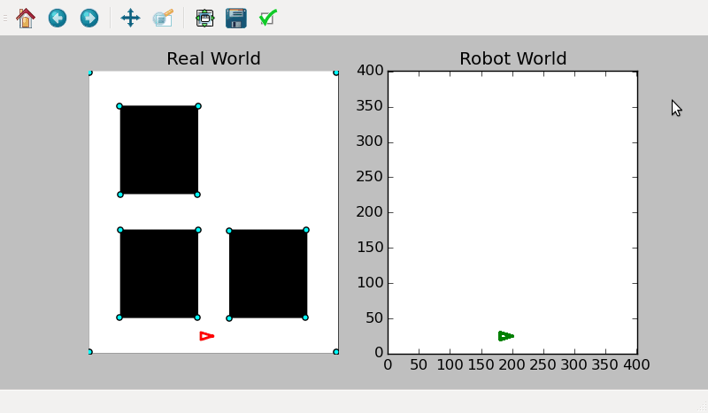

# SLAM Background {#localization-slam-assignment status=ready}

Congratulations! You have implemented a real-time localization algorithm for a flying drone.

While this code tends to work pretty well, consider the limitations of a localization algorithm which only works when a map of the environment is available beforehand. In the near future, we will likely see autonomous robots operating in our schools and homes. Such robots will have no access to maps of their environments beforehand; they will need to map their environments in real time!

To provide this functionality to the PiDrone, we will extend the localization particle filter such that each particle will not just estimate the path of the drone, but a map of the drone's environment.  

The algorithm that accomplishes this is called FastSLAM. A map in FastSLAM is represented by a set of **landmarks.** A Gaussian approximates the pose of the landmark. For us, this is a pose (x,y) and a 2x2 covariance matrix. In our implementation, a single landmark in the map corresponds to a single feature extracted by OpenCV.

Most SLAM algorithms seek to approximate the following probability distribution:

$p(\Theta, x^t | z^t, u^t)$

where $\Theta$ is the map consisting of N landmarks $\Theta=\theta_1,...\theta_N$
$x^t$ is the path of the robot $x^t= x_1,...,x_t$
$z^t$ is the sequence of measurements $z^t= z_1,...,z_t$
$u^t$ is the sequence of controls, $u^t= u_1,...,u_t$

ie approximate the path of the drone and the map of its environment given all past measurements and controls.

The main mathematical insight of FastSLAM is the ability to factor the above belief distribution by landmark:
$p(\Theta, x^t | z^t, u^t)=p(x^t | z^t, u^t)\Pi_n{p(\theta_n |x^t, z^t, u^t)}$

This factorization asserts the fact that landmark positions in the map are *conditionally independent* of one another if the path of the robot is known. Hence the product over n for each landmark $\theta_n$.

With this insight, we can represent the map with many 2-dimensional Gaussians, one for each landmark. Otherwise, as in the popular EKF SLAM algorithm, we would have to store and update a 2N-dimensional Gaussian, for N as the number of landmarks in the map. As you will see, our maps will grow to include hundreds of landmarks. Updating a covariance matrix with $(2N)^2$ entries for N=500 landmarks would not be so fun!

The basic steps of FastSLAM will closely resemble those of MC Localization: generate a set of particles and in each time step: update their positions with motion data, weight them based on their accuracy, and resample.

The following animation shows the operation of FastSLAM:

The blue corners of the rectangles are landmarks. As the robot perceives them, it plots a 2 dimensional gaussian (blue ellipse) around its belief of the landmark's position. Notice that as the robot revisits landmarks, the ellipses shrink (uncertainty decreases).
